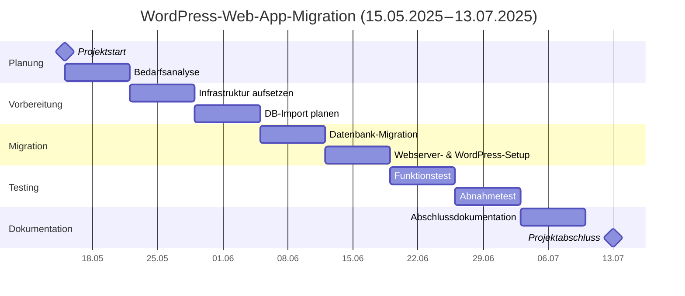

# Projektdokumentation – M158 LB2 <br>WordPress-Migration

## Übersicht
# Projektdokumentation – Webserver-Projekt

Diese Dokumentation ist nach den Aufgaben (1–14) gegliedert. Jede Aufgabe ist in drei Phasen unterteilt. Bitte tragen Sie Ihre Ergebnisse jeweils unter den entsprechenden Abschnitten ein.

---

## Aufgabe 1 – Projektplan erstellen

### Zeitplan


---

## Aufgabe 2 – Architekturdiagramm erstellen

### Stufe 1 - 3
Um die bestehende Webanwendung sicher in AWS zu betreiben, wird eine zweistufige Architektur gewählt. Diese besteht aus einem Webserver auf Amazon EC2 und einer Datenbank auf Amazon RDS (Relational Database Service). Die EC2-Instanz hostet die PHP-Webanwendung (inklusive Webserver wie Apache) und phpMyAdmin, während RDS eine verwaltete MySQL-Datenbank bereitstellt. Beide Systeme werden in einer gemeinsamen VPC betrieben, um interne Kommunikation zu ermöglichen und zugleich externe Zugriffe zu kontrollieren.


---

## Aufgabe 3 – AWS-Umgebung einrichten

### Stufe 1
Als erstes erstellen wir eine EC2 Instanz (Ubuntu). Wichtig hierbei ist es die Security Group für spätere HTTP/S Anfragen anzupassen.


### Stufe 2
Als Datenbank verwenden wir den RDS Dienst von AWS. Damit stellen wir einen persistenten und hochverfügbaren Speicher bereit.


Hier ist es ebenfalls wichtig die Security Group anzupasen, damit der Webserver sich mit der Datenbank verbinden lässt:


**Informationen zur Datenbank:**

DB_USERNAME: admin
DB_PASSWORD: Tony_onHisWAY218!
DB_URL: wp-database.c69qo3ofuvyq.us-east-1.rds.amazonaws.com

---

## Aufgabe 4 – DNS-Konfiguration

Ändern Sie die Stufe, für die Sie sich entschieden haben, selbst.

### Stufe 1

Ich habe es mir einfach gemacht und werde den DNS-Eintrag in meinem lokalen Hostfile eintragen. Unvorteilhaft ist hierbei, dass mein Webserver keine statische öffentliche IP hat. Das heisst, nach jedem Neustart der Instanz muss ich das Hostfile anpassen.


---

## Aufgabe 5 – Webserver konfigurieren

### Stufe 1
Wir installieren zu erst den Webserver Apache.

Danach legen wir ein Virtual Hosts File an:


Um das File effektiv zu machen, müssen wir die Site aktivieren:

```
sudo a2ensite m158
sudo systemctl reload apache2
```

Den Mod Rewrite schalten wir ebenfalls ein:

```
sudo a2enmod rewrite
sudo systemctl reload apache2
```

Die Rewrite Regeln setzen sich bei mir wiefolgt zusammen:

```
# BEGIN WordPress
<IfModule mod_rewrite.c>
  RewriteEngine On
  RewriteBase /
  RewriteRule ^index\.php$ - [L]
  RewriteCond %{REQUEST_FILENAME} !-f
  RewriteCond %{REQUEST_FILENAME} !-d
  RewriteRule . /index.php [L]
</IfModule>
# END WordPress
```


Wordpress User:

user: admin

Datenbank-User: wp_readwrite
Datenbank-Passwort: Tony_onHisWAY218!

### Stufe 2
Als erstes erstellen wir ein Zertifikat und unterzeichnen es selber:

```
sudo openssl req -x509 -nodes -days 365 \
  -newkey rsa:2048 \
  -keyout /etc/ssl/private/m158.key \
  -out /etc/ssl/certs/m158.crt \
  -subj "/C=CH/ST=ZH/L=Zuerich/O=MyOrg/CN=m158.davidpeter"
```

Wir aktivieren also das SSL Modul von Apache:

```
sudo a2enmod ssl
```

Auch hier müssen wir wieder eine Virtual Host Datei anlegen, jedoch dieses mal für SSL:

```
<IfModule mod_ssl.c>
<VirtualHost *:443>
  ServerName m158.davidpeter
  DocumentRoot /var/www/html

  SSLEngine on
  SSLCertificateFile    /etc/ssl/certs/m158.crt
  SSLCertificateKeyFile /etc/ssl/private/m158.key

  <Directory /var/www/html>
    AllowOverride All
    Require all granted
  </Directory>
</VirtualHost>
</IfModule>
Include conf-available/phpmyadmin.conf
```

Wir aktivieren die Site und starten Apache neu:

```
sudo a2ensite m158-ssl
sudo systemctl reload apache2
```

---

## Aufgabe 6 – PHP einrichten

### Stufe 1
Mit ```sudo apt install php``` eine unterstützte PHP-Version installiert.

### Stufe 2
Unter /etc/php/8.3/apache2/php.ini befindet sich das php.ini File. Darin müssen die angegeben Parameter verändert werden:

```
post_max_size = 64M
upload_max_filesize = 64M
max_execution_time = 120
```

Am leichtesten lassen sich die Parameter mit Strg + W suchen und finden (nano).

---

## Aufgabe 7 – MySQL/MariaDB aufsetzen

### Stufe 1 - 3
Das erstellen der Instanz erfolgt auf dem AWS GUI.

Der Zugriff auf die Datenbank erfolgt von unserer EC2-Instanz (erinnere dich an die Security Group). Als ich die Datenbank auf AWS erstellt habe, mussten ich einen Master-User definieren. Um die Sicherheit zu gewährleisten habe ich einen separaten User erstellt:

```
CREATE USER 'wp_readwrite'@'%' IDENTIFIED BY 'Tony_onHisWAY218!';
GRANT SELECT, INSERT, UPDATE, DELETE,
      CREATE, DROP, ALTER, LOCK TABLES
  ON wordpressdb.* TO 'wp_readwrite'@'%';
FLUSH PRIVILEGES;
```

Nun muss in der wp-config.php Datei dieser Endpoint definiert werden:

```
define('DB_USER',     'wp_readwrite');
define('DB_PASSWORD', 'Tony_onHisWAY218!');
define('DB_HOST',     'wp-database.c69qo3ofuvyq.us-east-1.rds.amazonaws.com:3306');
```

---

## Aufgabe 8 – Web-Datenbanktool (phpMyAdmin/Adminer)

### Stufe 1 & 3

PHPmyAdmin einfach mit folgenden Schritten aufbauen:

```
# 1. Ins temporäre Verzeichnis wechseln
cd /tmp

# 2. Aktuelles phpMyAdmin-Tarball herunterladen
wget https://www.phpmyadmin.net/downloads/phpMyAdmin-latest-all-languages.tar.gz

# 3. Archiv entpacken
tar xzf phpMyAdmin-latest-all-languages.tar.gz

# 4. Ins entpackte Verzeichnis wechseln und nach /usr/share verschieben
mv phpMyAdmin-*-all-languages /usr/share/phpmyadmin

# 5. Symlink ins DocumentRoot anlegen (sodass es unter /phpmyadmin erreichbar ist)
ln -s /usr/share/phpmyadmin /var/www/html/phpmyadmin

# 6. Beispiel-Config kopieren und anpassen
cp /usr/share/phpmyadmin/config.sample.inc.php /usr/share/phpmyadmin/config.inc.php

# 7. Dateiberechtigungen setzen
chown -R root:www-data /usr/share/phpmyadmin
find /usr/share/phpmyadmin -type d -exec chmod 755 {} \;
find /usr/share/phpmyadmin -type f -exec chmod 644 {} \;
```

Zum Schluss sollte die conf Datei etwa so aussehen:


### Stufe 2

Damit wir von unserem Webserver aus mit HTTPS auf PHPmyAdmin zugreifen können, müssen wir eine Zeile im SSL.conf hinzufügen:


---

## Aufgabe 9 – FTP-Zugang einrichten

### Stufe 0
Die Dateien wurden mit dem Filezilla Client vom FTP geholt und auf die Instanz kopiert:


---

## Aufgabe 10 – WordPress migrieren

### Stufe 1
Die DB wird mittels SQL-DUMP importiert:

```
mysql -h <RDS_ENDPOINT> -u <MASTER_USER> -p < wp_m158_db.sql
```

Anschliessend müssen die Berechtigungen festgelegt werden:

```
sudo chown -R www-data:www-data /var/www/html      # (Ubuntu)  
sudo find /var/www/html -type d -exec chmod 755 {} \;  
sudo find /var/www/html -type f -exec chmod 644 {} \;
```

### Stufe 2

Die wp-config.php Datei sollte angepasst werden mit den richtigen Angaben der Datenbank (falls nicht schon erledigt):


### Stufe 3
Damit unsere Datenbank mit unserer Umgebung übereinstimmt, müssen wir folgende Datenbank Einträge ändern:


---

## Aufgabe 11 - Backupkonzept erstellen

---

## Aufgabe 12 – Testing der Webapplikation

### Stufe 1
Sind alle Seiten erreichbar (phpmyadmin, wp-status etc.)?`


Ich kann mich auf die Webseite verbinden und mich frei bewegen:


PHPmyAdmin läuft:


Nun sind wir als Admin eingeloggt:


Das sieht der dedizierte PHPmyAdmin User für Wordpress:


Überprüfen wir unsere Einstellungen von PHP:


---

**Hinweis**:

Die Dateien im Ordner 02_Wordpress sind unverändert und stammen direkt vom FTP-Server der Lehrperson. Die geänderten Files und so weiter finden sich auf der EC2 Instanz.